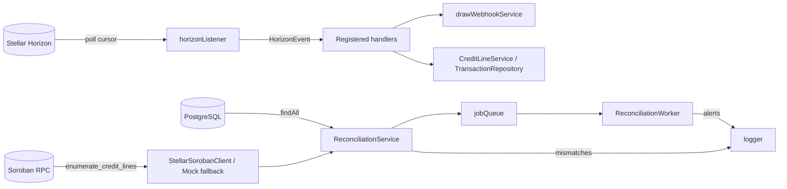

# Indexer & On-chain ↔ Off-chain Sync

The indexer's contract with the rest of the backend is simple: **what the chain saw, the DB must reflect — and we must prove it**. This document explains how the Horizon listener does that work, and how the reconciliation worker catches anything the listener misses.

If you want to debug a missing webhook, jump to §6.

---

## 1. Components



| Component | Role | File |
|---|---|---|
| `horizonListener` | Polls Horizon for contract events, emits to handlers | [`src/services/horizonListener.ts`](../src/services/horizonListener.ts) |
| `drawWebhookService` | Receives confirmed events, fans them out to subscribers | [`src/services/drawWebhookService.ts`](../src/services/drawWebhookService.ts) |
| `StellarSorobanClient` / `MockSorobanClient` | Reconciliation read path for enumerating Credit contract records | [`src/services/sorobanClient.ts`](../src/services/sorobanClient.ts) |
| `SorobanRpcClient` legacy helper | Legacy/simulated generic RPC helper; not the reconciliation source of truth | [`src/services/sorobanRpcClient.ts`](../src/services/sorobanRpcClient.ts) |
| `ReconciliationService` | Diffs DB vs chain, classifies mismatches | [`src/services/reconciliationService.ts`](../src/services/reconciliationService.ts) |
| `ReconciliationWorker` | Schedules reconciliation jobs on an interval | [`src/services/reconciliationWorker.ts`](../src/services/reconciliationWorker.ts) |
| `jobQueue` | In-process, at-least-once queue with retry & dead-letter | [`src/services/jobQueue.ts`](../src/services/jobQueue.ts) |

---

## 2. Cursor Model

```ts
let currentLedgerCursor: number | null = null;
```

The cursor is the **ledger sequence** of the last fully-processed ledger. It is updated only after every event in that ledger has been handed to every handler. Operating points:

| Mode | Behavior |
|---|---|
| Cold start | If no cursor exists, the listener begins from `HORIZON_START_LEDGER` (`latest` by default). For a backfill, set this to a specific ledger sequence. |
| Resume | On restart with an in-memory cursor lost, the listener restarts from `HORIZON_START_LEDGER`. For production, the cursor should be persisted; see §8. |
| Live | Once caught up, each tick polls `cursor → cursor + N` and processes returned events sequentially. |
| Catch-up | When polling returns more events than `pollIntervalMs` can normally consume, the listener keeps polling without backoff until the live edge is reached. |

The cursor is monotonic-increasing. A handler exception **does not** advance the cursor for the failed ledger, so the next poll redelivers — at-least-once across the entire pipeline.

---

## 3. Reorg & Gap Handling

Stellar's classical layer is final at network agreement; reorgs in the Ethereum sense don't occur on confirmed ledgers. But two adjacent failure modes do, and we handle both:

### 3.1 Gap detection

When the listener sees the next ledger jump beyond `cursor + 1` (e.g. Horizon returned a non-contiguous page after a transient outage or a rate-limit slow-down), it raises `isCursorGap`. The gap-recovery routine:

1. Increments `metrics.cursorGapsDetected`.
2. Queries the missing ledger range, capped at `HORIZON_MAX_CURSOR_GAP` ledgers.
3. On successful re-fetch: increments `metrics.cursorGapsRecovered`, replays events, advances cursor.
4. On failure: logs once, skips to `cursor + HORIZON_MAX_CURSOR_GAP`, and surfaces the skip via metrics so the reconciliation worker has a chance to detect resulting drift.

### 3.2 Reorg posture

For Soroban-emitted events on settled ledgers we treat the chain as final and dedupe by `eventId`. If a future protocol upgrade introduces unstable head behavior, the dedup set + reconciliation are sufficient: reconciliation will re-pull on-chain truth and flag any DB row that diverged.

---

## 4. Idempotency

`eventId = SHA256(ledger || contractId || topics || data)` — computed by the listener at receive time. Two layers of dedup:

- **In-process LRU** — `processedEventIds: Set<string>` capped at 10 000. Cleared opportunistically.
- **Domain events table** — anything the handler chooses to persist to `events` benefits from the unique partial index on `idempotency_key`.

Webhooks carry a stable `data.drawId` so subscribers can dedup independently of the in-process set's TTL.

---

## 5. Retry / Backoff

All env vars live in [`docs/HORIZON_LISTENER_CONFIG.md`](./HORIZON_LISTENER_CONFIG.md); the model is:

```
delay = min(initialBackoffMs × backoffMultiplier^(attempt-1) + jitter, maxBackoffMs)
jitter = ±10 % of computed delay
```

- **Transient errors** (5xx, `ETIMEDOUT`, `ECONNRESET`): retry up to `HORIZON_MAX_RETRIES`.
- **Rate-limit** (`HTTP 429`): pause for `HORIZON_RATE_LIMIT_DELAY_MS` (default 60 s) and **reset the retry counter** so we don't burn the budget on a slow upstream.
- **Hard 4xx (non-429)**: log once, no retry — these indicate misconfiguration.
- **Webhook fan-out** uses its own retry/backoff (`WEBHOOK_*` env vars).

Metrics tracked: `totalPolls`, `successfulPolls`, `failedPolls`, `eventsProcessed`, `eventsDuplicated`, `retryAttempts`, `rateLimitHits`, `cursorGapsDetected`, `cursorGapsRecovered`, `lastSuccessfulPoll`, `lastError`, `averagePollTime`. See `getMetrics()`.

---

## 6. Reconciliation — How Drift is Detected

Reconciliation is the safety net for everything the indexer can't be expected to catch (handler bug, lost cursor, missed event, manual DB edit). Run on a schedule and on demand.

```mermaid
sequenceDiagram
    autonumber
    participant Cron as ReconciliationWorker
    participant JQ as jobQueue
    participant RCS as ReconciliationService
    participant Repo as CreditLineRepository
    participant SRPC as Soroban
    participant Log

    Cron->>JQ: enqueue("reconcile")
    JQ->>RCS: handler
    RCS->>Repo: findAll(offset, 1 000) until exhausted or cap exceeded
    RCS->>SRPC: fetchAllCreditRecords()
    par per credit line
      RCS->>RCS: compare fields
    end
    RCS-->>JQ: ReconciliationResult { totalChecked, mismatches, errors }
    JQ->>Log: warning for warnings; critical mismatches throw → retry
```

### 6.1 Compared fields

`ReconciliationService` reads on-chain state through `createSorobanClient()`.
An empty `CREDIT_CONTRACT_ID` deliberately selects `MockSorobanClient` for
local development and tests. A non-empty contract id selects
`StellarSorobanClient`, which builds read-only `simulateTransaction` requests
against the Credit contract's `enumerate_credit_lines(start_after, limit)`
query and follows the contract's stable numeric cursor in pages of 100.

The contract returns `(u32, CreditLineData)` entries. The numeric id is the
contract enumeration cursor, not the backend database UUID, so reconciliation
matches DB rows and chain rows by borrower wallet address. `availableCredit` is
computed from `credit_limit - utilized_amount`; it is not expected as a stored
contract field. Timeout, retry, and jitter are controlled by
`SOROBAN_TIMEOUT_MS`, `SOROBAN_MAX_RETRIES`, and `SOROBAN_RETRY_JITTER_MS`.
Thrown and logged diagnostics redact Stellar public keys and secret seeds. If
either source has duplicate rows for the same borrower wallet, reconciliation
records an error instead of guessing which DB UUID belongs to which contract
cursor.

| Field | Severity if mismatched |
|---|---|
| Existence (DB has, chain doesn't, or vice versa) | **critical** |
| `walletAddress` identity drift | **critical** |
| `walletAddressFormatting` | **warning** |
| `creditLimit` | **critical** |
| `status` | **critical** |
| `availableCredit` | **warning** |
| `interestRateBps` | **warning** |

### 6.2 Trigger surfaces

- Periodic: `setInterval(RECONCILIATION_INTERVAL_MS)`, default 1 hour, configurable.
- Boot-time: `RECONCILIATION_RUN_IMMEDIATELY=true` (default) → one pass at start.
- Manual: `POST /api/reconciliation/trigger` (admin-gated).
- Inspection: `GET /api/reconciliation/status` returns `{ workerRunning, queueSize, failedJobs }`.

### 6.3 Failure recovery

- Critical mismatches → the worker's job handler throws. `jobQueue` retains the job for retry up to `maxAttempts` (default 3) with a visibility-timeout delay; after the budget is exhausted the job lands on the dead-letter list (`getFailedJobs()`).
- Warnings → logged with redaction, no retry.
- The reconciliation pass itself is stateless — there is no cursor to corrupt. Each invocation pages database rows in batches of 1 000 and fails loudly if the database side exceeds 10 000 records, so row 10 001 is never silently skipped. For larger fleets the service is designed to be sharded by borrower or limit-band; see TODO in [`docs/reconciliation.md`](./reconciliation.md).

---

## 7. Catch-up vs Live Mode

Both modes share the same code path; the only difference is whether the cursor is at the live edge:

| Mode | Indication | Behavior |
|---|---|---|
| Catch-up | Returned page is full (≥ batch size) or cursor lags by > N ledgers | Re-poll immediately after handlers complete; do not wait for `pollIntervalMs` |
| Live | Returned page is small / empty | Honour `pollIntervalMs`; emit `request:end`-style metric per tick |

Operationally, the live edge is reached when `metrics.averagePollTime` stabilizes below `POLL_INTERVAL_MS / 2` and `eventsProcessed` per tick approaches zero.

---

## 8. Persistence of Listener State

Today the cursor and dedup set are **in-memory**. Restarts re-bootstrap from `HORIZON_START_LEDGER`. For production deployments that need precise resume-on-crash:

1. Persist the cursor to a row in the `events` table (`event_type='listener_cursor'`, `aggregate_id=:contractId`, `payload={ ledger }`).
2. On boot, read the most recent row before subscribing.
3. Reconciliation already protects against any short replay window — duplicate handler invocations are idempotent.

This wiring is intentionally not in the default container so the in-memory listener can be unit-tested without a DB.

---

## 9. Failure Recovery — Operator Runbook

| Symptom | Likely cause | Action |
|---|---|---|
| `lastError` set, `failedPolls` rising | Horizon timeouts / 5xx | Verify `HORIZON_URL` reachable; raise `HORIZON_MAX_BACKOFF_MS` |
| `rateLimitHits` rising rapidly | Horizon throttling | Increase `POLL_INTERVAL_MS` or `HORIZON_RATE_LIMIT_DELAY_MS` |
| `cursorGapsDetected` ≫ `cursorGapsRecovered` | Sustained outage past `HORIZON_MAX_CURSOR_GAP` | Manually backfill: stop the listener, set `HORIZON_START_LEDGER=<gap-start>`, restart |
| Reconciliation `mismatches[]` reports `missing_db` | Indexer dropped event | Reconciliation will fix the *score* via re-evaluation; for a missed draw, replay the on-chain event via a manual job |
| `mismatches[]` reports `missing_chain` | DB write succeeded without on-chain confirmation | Investigate — this should never happen; treat as P0 |
| `failedJobs` accumulating in `/api/reconciliation/status` | Repeated critical mismatch | Inspect logs (`requestId` + `redactLogArgs` output), then `POST /api/reconciliation/trigger` once the underlying drift is fixed |

---

## 10. References

- [`src/services/horizonListener.ts`](../src/services/horizonListener.ts)
- [`src/services/reconciliationService.ts`](../src/services/reconciliationService.ts)
- [`src/services/reconciliationWorker.ts`](../src/services/reconciliationWorker.ts)
- [`src/services/jobQueue.ts`](../src/services/jobQueue.ts)
- [`src/services/sorobanRpcClient.ts`](../src/services/sorobanRpcClient.ts)
- [`src/services/drawWebhookService.ts`](../src/services/drawWebhookService.ts)
- [`docs/HORIZON_LISTENER_CONFIG.md`](./HORIZON_LISTENER_CONFIG.md)
- [`docs/reconciliation.md`](./reconciliation.md)
