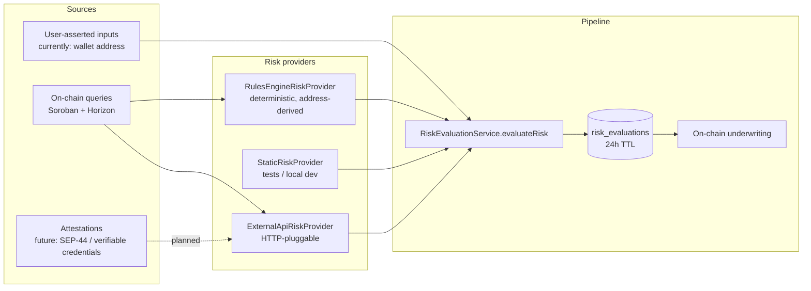
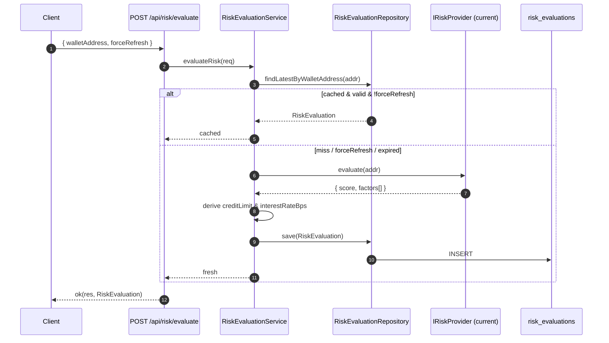
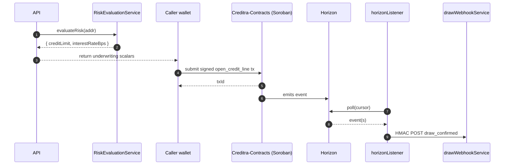

# Signals Ingest Pipeline

This is the differentiator. Creditra prices credit from **on-chain behavioral signals**, not collateral. This document explains how the off-chain backend collects, normalizes, weights, and hands those signals to the on-chain underwriting contract.

If you are scanning for novelty: skip to §3 (Normalization & Weighting) and §5 (On-chain Handoff).

---

## 1. What a "signal" is, in Creditra

A **signal** is any observable input that materially shifts the probability that a wallet will repay a draw on its credit line. Signals are not raw values — they are tuples:

```ts
interface RiskFactor {
  name: string;       // stable identifier, e.g. "address_entropy"
  value: number;      // normalized 0..1 (1 == strongest pro-credit evidence)
  weight: number;     // normalized 0..1, all weights sum to 1
  description?: string;
}
```

Defined in [`src/models/RiskEvaluation.ts`](../src/models/RiskEvaluation.ts), produced by every implementation of [`IRiskProvider`](../src/services/providers/IRiskProvider.ts), and persisted alongside the resulting `riskScore` in the `risk_evaluations.inputs` JSONB column so every credit decision is forensically replayable.

---

## 2. Sources

Signals enter the system from three classes of source, all funnelled through the same `IRiskProvider` interface:



| Source | Today | Trust model |
|---|---|---|
| On-chain queries | `RulesEngineRiskProvider` derives entropy/hash-spread/prefix features from the wallet address. Future providers will read transaction history, contract interaction graph, and asset balances via Soroban RPC + Horizon. | Trustless — verifiable by any node. |
| Attestations | Reserved interface in the `IRiskProvider` shape — `RiskFactor.description` is JSONB-safe, so attested signals (SEP-44, Stellar Quest badges, KYC vouchers) drop in as additional factors. | Pseudonymous; verifier-bound. |
| User-asserted | Only the wallet address itself, validated against `^G[A-Z2-7]{55}$` in [`stellarAddress.ts`](../src/utils/stellarAddress.ts) and surfaced via the [`walletAddressSchema`](../src/schemas/common.schema.ts). `forceRefresh` is the only other client-controllable input. | Untrusted — must be cryptographically reconcilable with chain truth. |

---

## 3. Normalization & Weighting Pipeline

The pipeline is **deterministic, side-effect-free, and replayable**.



### 3.1 Provider stage — raw → factor

Each provider must return:

```ts
{ score: number, factors: RiskFactor[] }
```

with `factor.value ∈ [0,1]`, `weight ∈ [0,1]`, and weights summing to `1`. The default `RulesEngineRiskProvider` ([source](../src/services/providers/RulesEngineRiskProvider.ts)) ships three rules:

| Factor | Default weight | Meaning |
|---|---|---|
| `address_entropy` | 0.35 | Shannon entropy of the address character distribution, normalized 0..1. Penalises low-entropy "vanity" addresses. |
| `address_hash_spread` | 0.40 | Deterministic hash mod normalisation — proxy for pseudo-random reputational priors. |
| `address_prefix_score` | 0.25 | Hash of the leading 8 chars — encodes prefix-cluster behavior. |

All three rules are pure functions of the address, so the score is reproducible. As soon as the on-chain history schema lands, rules will swap in (e.g. `loan_repayment_ratio`, `chain_age_days`, `interaction_diversity`).

### 3.2 Service stage — factors → headline

[`RiskEvaluationService`](../src/services/RiskEvaluationService.ts) takes the provider output and:

1. **Composite score.** `riskScore = clamp(round(Σ value × weight × 100), 0, 100)`. A 0..100 scale aligns with the on-chain underwriting function's expected domain.
2. **Risk level** (informational): `score < 40 → low`, `40–69 → medium`, `≥ 70 → high` (see [`riskService.ts`](../src/services/riskService.ts)).
3. **Credit limit derivation.** `creditLimit = baseCreditLimit (1000) × score / 100`. Higher score, larger limit.
4. **Interest rate derivation (inverse weighting).** `interestRateBps = baseRateBps (500) + baseRateBps × (100 - score) / 100`. Lower score, higher rate. Pure function, no surprise.
5. **Cache.** Persisted with `expiresAt = evaluatedAt + 24h`. The `inputs` JSONB column stores the full `factors[]` so the decision is auditable.

The base constants live in the service and are versioned with the source so historical evaluations are interpretable against the rule that produced them.

### 3.3 Validation invariants

Enforced at every layer:

| Layer | Invariant |
|---|---|
| Provider | `factors[].weight` sums to `1.0`; any factor outside `[0,1]` throws |
| Service | `score ∈ [0,100]`; `interestRateBps ∈ [0, 10000]` (basis points, max 100 %); `creditLimit > 0` |
| Schema | `riskEvaluateSchema` (Zod) requires a valid Stellar address; rejects extra keys |
| Repository | `risk_evaluations.risk_score` is `INTEGER` so non-integer scores cannot survive a write |

---

## 4. Privacy & Retention

Creditra is built on the assumption that **the wallet address is pseudonymous but not private**. We still apply minimization:

- **Logs.** All Stellar addresses pass through `redactLogArgs` ([`src/utils/logRedact.ts`](../src/utils/logRedact.ts)); the request logger truncates wallet fields to `first 6 + last 4` chars before emitting structured logs ([`src/middleware/requestLogger.ts`](../src/middleware/requestLogger.ts)).
- **Errors.** Stellar diagnostics pass through [`sanitizeStellarDiagnostic`](../src/services/stellarDiagnostics.ts), which strips public and secret keys from error text before logging or returning diagnostics.
- **Bodies.** Inputs are accepted into `req.body` only after Zod parse — extraneous fields are dropped (`additionalProperties: false`).
- **Storage.** The `risk_evaluations.inputs` JSONB stores only the normalized `factors[]`. Raw upstream API responses from `ExternalApiRiskProvider` are **not** persisted; we keep the model output, not the model input.
- **Retention.** Each evaluation TTLs after 24 h via `expiresAt`. The provided `cleanupExpiredEvaluations()` hook lets operators run a periodic eviction. Historical evaluations may be kept indefinitely for protocol auditability — that decision belongs to the deployment, not the codebase.
- **Right to opt out.** Because all signals derive from public chain data, opting a wallet out is equivalent to changing wallets. No off-chain identifier is required.

---

## 5. On-chain Handoff

The off-chain risk pipeline does not move money. It produces two scalars: `creditLimit` and `interestRateBps`. Those scalars are inputs to the signed Soroban `open_credit_line` transaction.



- **Contract surface used by the backend** lives in the `Creditra-Contracts` repo; reconciliation reads address it by `CREDIT_CONTRACT_ID` and chain `STELLAR_NETWORK_PASSPHRASE` (see [`src/services/sorobanClient.ts`](../src/services/sorobanClient.ts)).
- **Reads** go through `StellarSorobanClient` read-only simulation against pinned ledger state.
- **Writes** are signed transactions submitted by the calling wallet; the backend never holds borrower keys.
- **Confirmation** comes back through the indexer (§INDEXER.md) and is fanned out to subscribers as a `draw_confirmed` webhook.

### What the on-chain contract expects

Today the backend ships two scalars into the contract call site:

- `creditLimit` — used by the contract to gate `draw()` calls.
- `interestRateBps` — used by the contract for accrual.

The richer `factors[]` array stays off-chain (where storage is cheap and the audit trail is queryable). As the protocol matures, additional factors — e.g. attested KYC tier — can ride on-chain via the same call site by extending the contract entrypoint.

---

## 6. Adding a new signal

Concretely, to land a new behavioral signal:

1. **Pick a layer.** A rule of pure functions of the address → extend [`RulesEngineRiskProvider`](../src/services/providers/RulesEngineRiskProvider.ts). A historical query → add a new provider that reads Horizon/Soroban. An external attestation → use [`ExternalApiRiskProvider`](../src/services/providers/ExternalApiRiskProvider.ts) or write a new class against `IRiskProvider`.
2. **Define the factor.** Name (stable), value normaliser, weight. The provider must keep the weight sum at 1.0.
3. **Register.** Wire via the env var `RISK_PROVIDER`, or extend [`providerFactory.ts`](../src/services/providers/providerFactory.ts) to compose multiple providers.
4. **Test.** Each provider has a unit test under `src/services/providers/__tests__/`. Add fixture-driven tests for the new factor's monotonicity, bounds, and idempotency.
5. **Document.** Append a row to the factor table in §3.1 and to `docs/data-model.md` if the JSONB shape changes.

---

## 7. Why this is not "credit scoring with extra steps"

- **Open replay.** Every score in `risk_evaluations` has the exact factor inputs that produced it. There is no black-box ML behind a vendor key.
- **Composable trust.** Each provider can be swapped at runtime via env var. A regulator-friendly deployment can pin `static` to bypass the rules engine entirely while the on-chain enforcement stays identical.
- **Chain truth wins ties.** The reconciliation worker (see [`docs/INDEXER.md`](./INDEXER.md)) reverses any DB-vs-chain disagreement back toward the chain. The off-chain pipeline can only ever *suggest* limits; the contract owns the gate.
- **Privacy by minimization.** No PII collected at any layer.

---

## 8. References

- [`src/services/RiskEvaluationService.ts`](../src/services/RiskEvaluationService.ts)
- [`src/services/providers/IRiskProvider.ts`](../src/services/providers/IRiskProvider.ts)
- [`src/services/providers/RulesEngineRiskProvider.ts`](../src/services/providers/RulesEngineRiskProvider.ts)
- [`src/services/providers/StaticRiskProvider.ts`](../src/services/providers/StaticRiskProvider.ts)
- [`src/services/providers/ExternalApiRiskProvider.ts`](../src/services/providers/ExternalApiRiskProvider.ts)
- [`src/services/providers/providerFactory.ts`](../src/services/providers/providerFactory.ts)
- [`src/models/RiskEvaluation.ts`](../src/models/RiskEvaluation.ts)
- [`migrations/001_initial_schema.sql`](../migrations/001_initial_schema.sql) — `risk_evaluations` table
